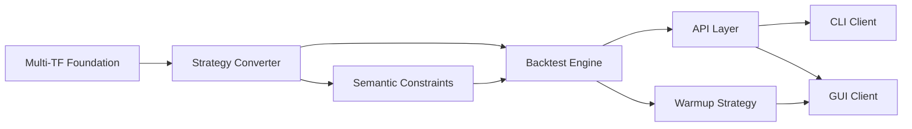

# 🗺️ DarwinX Trading Bot - Roadmap Actualizado v2.0

## 📊 Estado Actual del Proyecto (Octubre 2025)

### ✅ **COMPLETADO (50% del proyecto total)**

| Crate | Progreso | Estado | LOC | Funcionalidad |
|-------|----------|--------|-----|---------------|
| **Core** | 100% ✅ | Production Ready | 1,500 | Types, traits fundamentales |
| **Indicators** | 100% ✅ | Production Ready | 2,000 | 16 indicadores + registry dinámico |
| **API Proto** | 100% ✅ | Production Ready | 800 | gRPC definitions |
| **Strategy Store** | 95% ✅ | Nearly Complete | 2,500 | DB models + repositories |
| **Strategy Generator** | 100% ✅ | Production Ready | 3,500 | Random + Genetic + AST |

**Total Completado**: ~10,300 LOC

### ⚠️ **PARCIALMENTE COMPLETADO**

| Crate | Progreso | Estado | Falta Implementar |
|-------|----------|--------|-------------------|
| **Data** | 40% ⚠️ | Needs Multi-TF | `multi_timeframe.rs` (solo stub) |

### ❌ **PENDIENTE (50% del proyecto)**

| Crate | Progreso | Prioridad | Complejidad | LOC Estimado |
|-------|----------|-----------|-------------|--------------|
| **Strategy Converter** | 0% ❌ | 🔥 **CRÍTICO** | ⭐⭐⭐⭐ | 2,000 |
| **Backtest Engine** | 0% ❌ | 🔥 **CRÍTICO** | ⭐⭐⭐⭐⭐ | 4,000 |
| **Data Manager** | 0% ❌ | 🔥 **ALTO** | ⭐⭐⭐ | 1,500 |
| **Optimizer** | 0% ❌ | 🔥 **ALTO** | ⭐⭐⭐⭐ | 2,500 |
| **Runner Live** | 0% ❌ | 🔥 **ALTO** | ⭐⭐⭐⭐⭐ | 3,000 |
| **API Server** | 0% ❌ | 🔥 **ALTO** | ⭐⭐⭐⭐ | 3,500 |
| **API Client** | 0% ❌ | 🔥 **MEDIO** | ⭐⭐⭐ | 2,000 |
| **CLI Client** | 0% ❌ | 🔥 **MEDIO** | ⭐⭐⭐ | 2,000 |
| **GUI Client** | 0% ❌ | 🔥 **MEDIO** | ⭐⭐⭐⭐⭐ | 4,500 |

**Total Pendiente**: ~25,000 LOC

---

## 🚀 **ROADMAP v2.0 - Multi-Timeframe + Rhai**

### **FASE 1: Multi-Timeframe Foundation** 
**⏱️ Duración**: 2 semanas  
**🎯 Objetivo**: Completar soporte multi-timeframe en data layer

#### Semana 1: Data Multi-Timeframe Core
```rust
// 🎯 Targets de la semana
crates/data/src/multi_timeframe/
├── context.rs           ✨ NEW - Multi-TF context manager
├── synchronizer.rs      ✨ NEW - Timeframe synchronization  
├── cache.rs            ✨ NEW - Multi-TF data cache
└── alignment.rs        ✨ NEW - Temporal alignment
```

**Deliverables**:
- [ ] `MultiTimeframeContext` - Manage multiple timeframe data
- [ ] `TimeframeSynchronizer` - Sync diferentes TFs con forward-fill
- [ ] `MultiTimeframeDataCache` - Cache eficiente por TF
- [ ] **Testing**: Unit tests para sincronización
- [ ] **Performance**: Benchmarks de memoria y speed

#### Semana 2: Strategy AST Multi-Timeframe  
```rust
// 🎯 Extend existing AST para multi-TF
crates/strategy-generator/src/ast/
├── nodes.rs            🔧 UPDATE - Add TimeframeCategory
├── builder.rs          🔧 UPDATE - Multi-TF builder methods
└── validator.rs        🔧 UPDATE - Multi-TF validation
```

**Deliverables**:
- [ ] `TimeframeCategory` enum (Current/Medium/High)
- [ ] `IndicatorType` con timeframe_category field
- [ ] `StrategyBuilder` con métodos multi-TF
- [ ] **Testing**: Multi-TF strategy creation
- [ ] **Validation**: Timeframe consistency checks

### **FASE 2: Strategy Converter (Hub Central)**
**⏱️ Duración**: 3 semanas  
**🎯 Objetivo**: Crear el hub central de conversión de estrategias

#### Semana 3: Converter Foundation
```rust
// 🎯 Crear crate completamente nuevo
crates/strategy-converter/
├── Cargo.toml          ✨ NEW
└── src/
    ├── lib.rs          ✨ NEW - Main converter interface
    ├── formats.rs      ✨ NEW - Format definitions
    └── error.rs        ✨ NEW - Conversion errors
```

**Deliverables**:
- [ ] `StrategyConverter` trait definition
- [ ] Format enum (Polars/EventDriven/Rhai/FreqTrade)
- [ ] Error handling para conversions
- [ ] **Testing**: Basic conversion framework

#### Semana 4: Rhai Parser Implementation
```rust
// 🎯 Rhai → AST conversion
crates/strategy-converter/src/inputs/
├── rhai_parser.rs      ✨ NEW - Rhai script parser
├── rhai_validator.rs   ✨ NEW - Rhai semantic validation
└── rhai_functions.rs   ✨ NEW - Built-in functions
```

**Deliverables**:
- [ ] `RhaiParser::parse()` - Rhai script → StrategyAST
- [ ] Built-in functions: `indicator()`, `entry_rules()`, etc.
- [ ] Semantic validation (timeframe consistency, indicators exist)
- [ ] **Testing**: Parse complex Rhai scripts
- [ ] **Examples**: 5+ realistic Rhai strategy examples

#### Semana 5: Output Formats
```rust
// 🎯 AST → Executable formats
crates/strategy-converter/src/outputs/
├── polars_query.rs     ✨ NEW - AST → Polars query
├── event_driven.rs     ✨ NEW - AST → Event strategy
└── rhai_runtime.rs     ✨ NEW - AST → Optimized Rhai
```

**Deliverables**:
- [ ] `to_polars_query()` - Para backtest masivo
- [ ] `to_event_driven()` - Para backtest realista  
- [ ] `to_rhai_runtime()` - Para live execution
- [ ] **Testing**: Round-trip conversions (AST → Format → AST)
- [ ] **Performance**: Benchmark conversion speed

### **FASE 3: Semantic Constraints + Similarity**
**⏱️ Duración**: 2 semanas  
**🎯 Objetivo**: Generador masivo inteligente con constraints

#### Semana 6: Correlation Calculator
```rust
// 🎯 Real correlation entre indicadores
crates/strategy-converter/src/similarity/
├── correlation.rs      ✨ NEW - Pearson correlation calculator
├── matrix_builder.rs   ✨ NEW - Pre-compute correlation matrix
└── cache.rs           ✨ NEW - Similarity cache manager
```

**Deliverables**:
- [ ] `IndicatorSimilarityCalculator` con Pearson correlation
- [ ] Pre-compute correlation matrix para todos los indicadores
- [ ] Cache persistente en disco
- [ ] **Testing**: Validate correlations con datos reales
- [ ] **Data**: Reference dataset (BTCUSDT 1 año) para correlaciones

#### Semana 7: Semantic Constraints
```rust
// 🎯 Update generator con constraints
crates/strategy-generator/src/
├── constraints.rs      🔧 UPDATE - Add SemanticConstraints
└── generator/
    ├── random.rs       🔧 UPDATE - Use constraints
    └── genetic.rs      🔧 UPDATE - Use constraints
```

**Deliverables**:
- [ ] `SemanticConstraints` struct con category limits + similarity
- [ ] `RandomGenerator` respeta constraints automáticamente
- [ ] `GeneticGenerator` usa similarity en fitness
- [ ] **Testing**: Generate 10,000 strategies sin correlaciones altas
- [ ] **Metrics**: Diversity analysis de strategies generadas

### **FASE 4: Backtest Engine Dual Mode**
**⏱️ Duración**: 4 semanas  
**🎯 Objetivo**: Motor de backtest dual (Polars + Event-driven)

#### Semana 8-9: Polars Vectorized Engine
```rust
// 🎯 Crear crate completamente nuevo  
crates/backtest-engine/
├── Cargo.toml          ✨ NEW
└── src/
    ├── lib.rs          ✨ NEW
    ├── polars_engine.rs ✨ NEW - Vectorized mass backtest
    └── polars_engine/
        ├── vectorized.rs ✨ NEW - Polars operations
        ├── parallel.rs   ✨ NEW - Rayon parallelization  
        └── metrics.rs    ✨ NEW - Performance metrics
```

**Deliverables Semana 8**:
- [ ] `PolarsBacktestEngine` basic structure
- [ ] Single strategy backtest con Polars
- [ ] Basic metrics calculation (return, sharpe, trades)
- [ ] **Testing**: Single strategy accuracy

**Deliverables Semana 9**:
- [ ] Batch backtest de 1000+ strategies en paralelo
- [ ] Memory-efficient chunking
- [ ] Progress reporting para batch jobs
- [ ] **Performance**: 10,000 strategies en < 60 min
- [ ] **Testing**: Mass backtest reliability

#### Semana 10-11: Event-Driven Engine
```rust
// 🎯 Event-driven simulation realista
crates/backtest-engine/src/
├── event_driven.rs     ✨ NEW - Event-by-event simulation
└── event_driven/
    ├── engine.rs       ✨ NEW - Main simulation loop
    ├── order_book.rs   ✨ NEW - Order book simulation
    ├── execution.rs    ✨ NEW - Realistic execution
    └── slippage.rs     ✨ NEW - Slippage modeling
```

**Deliverables Semana 10**:
- [ ] `EventDrivenEngine` basic structure
- [ ] Tick-by-tick strategy evaluation
- [ ] Order placement and execution simulation
- [ ] **Testing**: Event engine accuracy vs Polars

**Deliverables Semana 11**:
- [ ] Realistic slippage y commission modeling
- [ ] Order book simulation para market impact
- [ ] Detailed trade analysis y metrics
- [ ] **Performance**: 100 strategies en < 30 min
- [ ] **Validation**: Backtest results vs historical performance

### **FASE 5: Warmup Strategy**
**⏱️ Duración**: 2 semanas  
**🎯 Objetivo**: Live trading warmup inteligente

#### Semana 12: Warmup Planning
```rust
// 🎯 Warmup decision logic
crates/runner-live/
├── Cargo.toml          ✨ NEW
└── src/
    ├── lib.rs          ✨ NEW
    ├── warmup/
    │   ├── planner.rs  ✨ NEW - Warmup planning logic
    │   ├── limits.rs   ✨ NEW - Timeframe limits
    │   └── validator.rs ✨ NEW - Strategy viability
    └── data/
        ├── downloader.rs ✨ NEW - Historical data download
        └── cache.rs     ✨ NEW - Warmup data cache
```

**Deliverables**:
- [ ] `WarmupPlanner` - Calculate requirements per strategy
- [ ] `WarmupLimits` - Realistic limits por timeframe
- [ ] Strategy viability validation
- [ ] **Testing**: Warmup planning para different strategies
- [ ] **Examples**: EMA(200) 1d vs RSI(14) 5m planning

#### Semana 13: Historical Data Download
```rust
// 🎯 Download & cache historical data
crates/data-manager/
├── Cargo.toml          ✨ NEW
└── src/
    ├── lib.rs          ✨ NEW
    ├── downloaders/
    │   ├── binance.rs  ✨ NEW - Binance historical API
    │   ├── bybit.rs    ✨ NEW - Bybit historical API
    │   └── yahoo.rs    ✨ NEW - Yahoo Finance API
    └── cache/
        ├── storage.rs  ✨ NEW - Parquet storage
        └── manager.rs  ✨ NEW - Cache management
```

**Deliverables**:
- [ ] Multi-exchange historical data downloaders
- [ ] Rate limiting y retry logic
- [ ] Efficient Parquet storage para warmup data
- [ ] **Testing**: Download 1 year data < 5 min
- [ ] **Integration**: Warmup planner + downloader

### **FASE 6: API Layer (gRPC Server + Client)**
**⏱️ Duración**: 2 semanas  
**🎯 Objetivo**: Complete gRPC API implementation

#### Semana 14: gRPC Server
```rust
// 🎯 Implementar todos los services
crates/api-server/
├── Cargo.toml          ✨ NEW
└── src/
    ├── main.rs         ✨ NEW - Server startup
    ├── server.rs       ✨ NEW - Main server
    └── services/
        ├── strategy_service.rs  ✨ NEW - Strategy CRUD + Rhai
        ├── backtest_service.rs  ✨ NEW - Dual mode backtest
        ├── optimizer_service.rs ✨ NEW - Parameter optimization
        └── live_service.rs      ✨ NEW - Live trading
```

**Deliverables**:
- [ ] Complete `StrategyService` implementation (CRUD + Rhai parsing)
- [ ] Complete `BacktestService` implementation (dual mode)
- [ ] Complete `OptimizerService` implementation
- [ ] **Testing**: All gRPC endpoints functional
- [ ] **Performance**: < 10ms latency for basic operations

#### Semana 15: gRPC Client
```rust
// 🎯 Client library para CLI y GUI
crates/api-client/
├── Cargo.toml          ✨ NEW
└── src/
    ├── lib.rs          ✨ NEW - Client library
    └── services/
        ├── strategy_client.rs   ✨ NEW - Strategy service client
        ├── backtest_client.rs   ✨ NEW - Backtest service client
        ├── optimizer_client.rs  ✨ NEW - Optimizer service client
        └── live_client.rs       ✨ NEW - Live service client
```

**Deliverables**:
- [ ] Complete client library para all services
- [ ] Connection management y retry logic
- [ ] **Testing**: Client-server integration tests
- [ ] **Examples**: Example usage de all client functions

### **FASE 7: CLI Client**
**⏱️ Duración**: 1 semana  
**🎯 Objetivo**: Command-line interface funcional

#### Semana 16: CLI Implementation
```rust
// 🎯 CLI client usando api-client
crates/cli-client/
├── Cargo.toml          ✨ NEW
└── src/
    ├── main.rs         ✨ NEW - CLI entry point
    ├── commands/
    │   ├── generate.rs ✨ NEW - Generate strategies
    │   ├── backtest.rs ✨ NEW - Run backtests
    │   ├── rhai.rs     ✨ NEW - Rhai script commands
    │   └── live.rs     ✨ NEW - Live trading commands
    └── output/
        ├── table.rs    ✨ NEW - Table formatting
        └── progress.rs ✨ NEW - Progress bars
```

**Deliverables**:
- [ ] Complete CLI con all major operations
- [ ] Rhai script parsing y validation from CLI
- [ ] Progress bars para long-running operations
- [ ] **Testing**: End-to-end CLI workflows
- [ ] **Documentation**: CLI usage guide

### **FASE 8: GUI Client (GTK4 + Rhai Editor)**
**⏱️ Duración**: 4 semanas  
**🎯 Objetivo**: Native GUI con Rhai script editor

#### Semana 17-18: GUI Foundation
```rust
// 🎯 GTK4/Relm4 foundation
crates/gui-client/
├── Cargo.toml          ✨ NEW
└── src/
    ├── main.rs         ✨ NEW - GUI entry point
    ├── app.rs          ✨ NEW - Main app structure
    └── components/
        ├── sidebar.rs       ✨ NEW - Navigation sidebar
        ├── generator_view.rs ✨ NEW - Strategy generator view
        └── backtest_view.rs  ✨ NEW - Backtest view
```

**Deliverables Semana 17**:
- [ ] Basic GTK4 app structure con Relm4
- [ ] Navigation sidebar con different views
- [ ] Connection a gRPC server
- [ ] **Testing**: Basic GUI functionality

**Deliverables Semana 18**:
- [ ] Strategy generator view (parameters, constraints)
- [ ] Backtest view (strategy selection, mode selection)
- [ ] Progress indicators para long operations
- [ ] **Testing**: Generator + backtest workflows

#### Semana 19-20: Rhai Editor + Advanced Views
```rust
// 🎯 Advanced GUI features
crates/gui-client/src/components/
├── rhai_editor.rs      ✨ NEW - Rhai script editor con syntax highlighting
├── strategy_list.rs    ✨ NEW - Strategy management
├── results_view.rs     ✨ NEW - Backtest results visualization
└── live_view.rs        ✨ NEW - Live trading dashboard
```

**Deliverables Semana 19**:
- [ ] Rhai script editor con syntax highlighting (GTK SourceView)
- [ ] Script validation en tiempo real
- [ ] Script templates y examples
- [ ] **Testing**: Rhai editor functionality

**Deliverables Semana 20**:
- [ ] Strategy list con filtering y sorting
- [ ] Backtest results visualization (charts, metrics)
- [ ] Live trading dashboard (basic)
- [ ] **Testing**: Complete GUI workflows
- [ ] **Polish**: UI/UX improvements

---

## 🎯 **MILESTONES & SUCCESS CRITERIA**

### **Milestone 1**: Multi-Timeframe Ready (End Week 2)
- [ ] ✅ Multi-timeframe data loading functional
- [ ] ✅ Strategy AST supports timeframe categories  
- [ ] ✅ All tests passing
- [ ] **Success**: Create EMA(200) 1h + RSI(14) 5m strategy

### **Milestone 2**: Rhai Integration Complete (End Week 5)
- [ ] ✅ Rhai scripts parse to StrategyAST
- [ ] ✅ Multi-format conversion working
- [ ] ✅ Semantic validation functional
- [ ] **Success**: Parse 100+ different Rhai scripts without errors

### **Milestone 3**: Intelligent Generator (End Week 7)
- [ ] ✅ Semantic constraints preventing correlation
- [ ] ✅ Generate 10,000 diverse strategies
- [ ] ✅ Similarity calculator working
- [ ] **Success**: Generated strategies have < 70% max correlation

### **Milestone 4**: Dual Backtest Engine (End Week 11)
- [ ] ✅ Polars mode: 10,000 strategies < 60 min
- [ ] ✅ Event mode: 100 strategies < 30 min  
- [ ] ✅ Both modes produce consistent results
- [ ] **Success**: Full backtest pipeline functional

### **Milestone 5**: Live Trading Ready (End Week 13)
- [ ] ✅ Warmup planning working para all timeframes
- [ ] ✅ Historical data download functional
- [ ] ✅ Strategy viability validation
- [ ] **Success**: Live trading system can start for 95% of strategies

### **Milestone 6**: Full API (End Week 15)
- [ ] ✅ Complete gRPC server implementation
- [ ] ✅ Client library functional
- [ ] ✅ All services tested end-to-end
- [ ] **Success**: Client-server communication complete

### **Milestone 7**: CLI Complete (End Week 16)
- [ ] ✅ All major operations available via CLI
- [ ] ✅ Rhai script handling from command line
- [ ] ✅ User-friendly output formatting
- [ ] **Success**: Complete workflows possible via CLI only

### **Milestone 8**: GUI Complete (End Week 20)
- [ ] ✅ Native GUI con all functionality
- [ ] ✅ Rhai editor con syntax highlighting
- [ ] ✅ Visual strategy management
- [ ] **Success**: Non-technical users can create strategies

---

## 📊 **RESOURCE ALLOCATION**

### **Developer Time Allocation**

| Fase | Duración | Core Focus | Complexity | Risk Level |
|------|----------|------------|------------|------------|
| **Multi-TF Foundation** | 2 weeks | Data layer | ⭐⭐⭐ | 🟡 Medium |
| **Strategy Converter** | 3 weeks | Conversion hub | ⭐⭐⭐⭐ | 🔴 High |
| **Semantic Constraints** | 2 weeks | ML correlation | ⭐⭐⭐ | 🟡 Medium |
| **Backtest Engine** | 4 weeks | Performance critical | ⭐⭐⭐⭐⭐ | 🔴 High |
| **Warmup Strategy** | 2 weeks | Live trading prep | ⭐⭐⭐⭐ | 🔴 High |
| **API Layer** | 2 weeks | Network layer | ⭐⭐⭐ | 🟡 Medium |
| **CLI Client** | 1 week | User interface | ⭐⭐ | 🟢 Low |
| **GUI Client** | 4 weeks | Complex UI | ⭐⭐⭐⭐ | 🟡 Medium |

### **Critical Path Dependencies**



**Critical Path**: A → B → C → D → E/F (16-20 weeks)
**Parallel Opportunities**: 
- Semantic Constraints (Week 6-7) parallel con Backtest Engine start
- CLI y GUI development pueden ser paralelos (Week 16-20)

---

## 🚨 **RISK MITIGATION**

### **High-Risk Areas**

| Risk | Impact | Mitigation Strategy |
|------|--------|-------------------|
| **Polars Performance** | 🔴 Critical | Benchmark early, fallback a custom vectorization |
| **Multi-TF Complexity** | 🔴 High | Start simple, iterate complexity |
| **Rhai Integration** | 🟡 Medium | Prototype early, validate parsing approach |
| **Exchange API Limits** | 🟡 Medium | Multiple exchanges, rate limiting, caching |
| **GTK4 Dependencies** | 🟡 Medium | Docker containers, clear setup documentation |

### **Contingency Plans**

**If Polars is too slow**:
- Fallback: Custom vectorization con Rayon
- Timeline impact: +2 weeks

**If Multi-TF is too complex**:
- Fallback: Single timeframe + manual timeframe selection
- Timeline impact: No impact, simpler implementation

**If Rhai parsing fails**:
- Fallback: JSON DSL con validation
- Timeline impact: +1 week

---

## 📈 **SUCCESS METRICS**

### **Technical Performance**

| Metric | Target | Measurement Method |
|--------|--------|--------------------|
| **Rhai Parse Time** | < 50ms per script | Benchmark suite |
| **Mass Backtest** | 10,000 strategies < 60min | CI performance tests |
| **Realistic Backtest** | 100 strategies < 30min | CI performance tests |
| **Memory Usage** | < 2GB total system | Resource monitoring |
| **gRPC Latency** | < 10ms p99 localhost | Load testing |

### **Functional Completeness**

| Feature | Success Criteria | Validation Method |
|---------|------------------|-------------------|
| **Multi-TF Strategies** | Create EMA(1h)+RSI(5m) strategy | Integration test |
| **Rhai Scripts** | Parse 100+ different scripts | Test suite |
| **Constraint Enforcement** | Max 70% correlation entre indicators | Statistical validation |
| **Warmup Planning** | 95% strategies viable for live | Planning algorithm test |
| **End-to-End** | CLI create→backtest→optimize workflow | E2E test |

### **User Experience**

| Aspect | Target | Measurement |
|--------|--------|-------------|
| **Learning Curve** | Non-dev can create strategy in 30min | User testing |
| **System Reliability** | 99.9% uptime durante testing | Monitoring |
| **Error Messages** | Clear, actionable error messages | User feedback |
| **Documentation** | Complete API + user guides | Documentation review |

---

## 🏁 **FINAL DELIVERABLES**

### **Week 20 - Complete System**

✅ **Functional System**:
- Multi-timeframe strategy creation (manual + automatic)
- Rhai scripting para strategies  
- Dual backtest engine (mass + realistic)
- Live trading con warmup
- Complete gRPC API
- Native GUI + CLI interfaces

✅ **Code Quality**:
- >80% test coverage
- Complete documentation
- CI/CD pipeline
- Performance benchmarks
- Security audit

✅ **User Experience**:
- Strategy creation in <30 min
- Backtest 10,000 strategies <60 min  
- Live trading setup <10 min
- Professional UI/UX

---

## 📅 **TIMELINE SUMMARY**

| Phase | Weeks | Key Deliverables |
|-------|-------|------------------|
| **1. Multi-TF Foundation** | 1-2 | Multi-timeframe data + AST |
| **2. Strategy Converter** | 3-5 | Rhai parsing + format conversion |
| **3. Semantic Constraints** | 6-7 | Intelligent generator + correlation |
| **4. Backtest Engine** | 8-11 | Dual mode backtest (Polars + Event) |
| **5. Warmup Strategy** | 12-13 | Live trading warmup + data download |
| **6. API Layer** | 14-15 | Complete gRPC server + client |
| **7. CLI Client** | 16 | Command-line interface |
| **8. GUI Client** | 17-20 | Native GUI + Rhai editor |

**Total Duration**: **20 weeks (5 months)**
**Expected Completion**: **March 2026**

---

**🎯 Next Action**: Begin **Fase 1** - Complete `data/multi_timeframe.rs` implementation

**Prepared by**: DarwinX Development Team  
**Last Updated**: October 2025  
**Status**: ✅ **Ready for Development v2.0**
